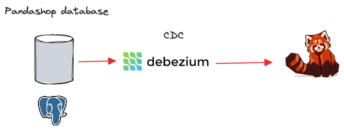

# Postgres CDC with Debezium and Redpanda



## Overview
This sample demonstrates using Debezium to capture the changes made to Postgres in real time and stream them to Redpanda.

This read-to-run `docker-compose` setup contains the following containers:
- `postgres` container with the `pandashop` database, containing a single table, `orders`
- `debezium` container captuing changes made to the `orders` table in real time. 
- `redpanda` container to ingest change data streams produced by `debezium`

For more information about `pandashop` schema, refer to the `/data/postgres_bootstrap.sql` file.

## Set up guide

### Start the containers
Start the set up by running:

```
docker compose up -d
```

Wait until you get the status of all containers as `running` or `running (healthy)` after executing `docker compose ps`.

### Verify the database
Upon `postgres` container startup, the `/data/postgres_bootstrap.sql` file creates the `pandashop` database and the `orders` table, followed by seeding the ` orders` table with a few records.

To verify that, log into Postgres by running:

```sql
docker compose exec postgres psql -U postgresuser -d pandashop
```

Then check the content inside the `orders` table as:

```sql
select * from orders;
```

This is going to be our source table.

### Create a Postgres source connector configuration for Debezium
While Debezium is up and running, let's create a source connector configuration to extract change data feeds from Postgres.

```
docker compose exec debezium `curl -H 'Content-Type: application/json' debezium:8083/connectors --data '
{
  "name": "postgres-connector",  
  "config": {
    "connector.class": "io.debezium.connector.postgresql.PostgresConnector", 
    "plugin.name": "pgoutput",
    "database.hostname": "postgres", 
    "database.port": "5432", 
    "database.user": "postgresuser", 
    "database.password": "postgrespw", 
    "database.dbname" : "pandashop", 
    "database.server.name": "postgres", 
    "table.include.list": "public.orders",
    "topic.prefix" : "dbz"
  }
}'
```

Notice the `database.*` configurations specifying the connectivity details to `postgres` container. Wait a minute or two until the connector gets deployed inside Debezium and creates the initial snapshot of change log topics in Redpanda. 

### Verify change log topics in Redpanda
Next, check the list of change log topics in `redpanda` by running:

```
docker-compose exec redpanda rpk topic list
```

You will see topics with the prefix `dbz.*` specified in the connector configuration. The topic `dbz.public.orders` holds the initial snapshot of change log events streamed from `orders` table.

```
NAME               PARTITIONS  REPLICAS
connect-status     5           1
connect_configs    1           1
connect_offsets    25          1
dbz.public.orders  1           1
```

Finally, you can see the shape of change events by consuming the `dbz.public.orders` topic.

```
docker-compose exec redpanda rpk topic consume dbz.public.orders 
```

You should see JSON formatted change events.

While the consumer is running, let's open another terminal to insert a record to the `orders` table.

```
docker-compose exec postgres psql -U postgresuser -d pandashop 
```

Then insert the following record:

```sql
INSERT INTO orders (customer_id, total) values (5, 500);
```

This will trigger a change event in Debezium, immediately publishing it to `dbz.public.orders` Redpanda topic, causing the consumer to display a new event in the console. That proves the end to end functionality of our CDC pipeline.

## What's next?
Now that you have change log events ingested into Redpanda. You process change log events to enable use cases such as:
- Database replication
- Stream processing applications
- Streaming ETL pipelines
- Update caches
- Event-driven Microservices

etc.