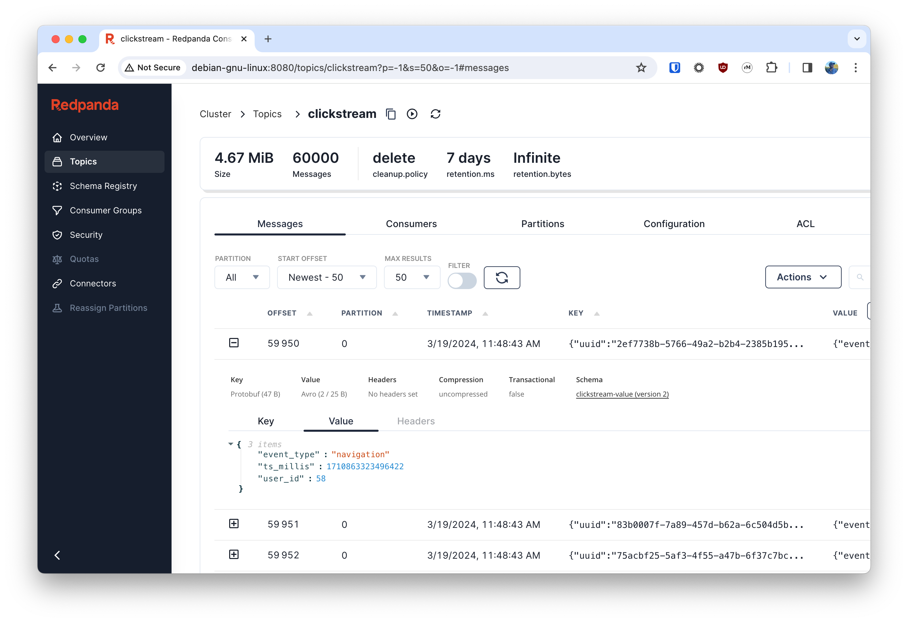

# End to End Example with Schema Registry
This demo shows how to produce and consume data using Redpanda's Schema Registry. It generates some fake "clickstream" data and serializes the keys and values using Protobufs and Avro respectively.

> Yes, that's a bit bizarre...but it's to show both approaches in the same demo :-)

## Prerequisites
You should have Python 3, `rpk`, and create a topic (so you can dictate number of partitions). You also need Redpanda.

### Redpanda
You can either run locally using the provided Docker Compose file:

```
$ docker compose up -d
```

> If using multiple terminals, you can drop `-d` and let it run in the foreground.

Or use a remote instance of Redpanda. If using a remote instance, you'll need to set some environment variables used by the Python code for connecting:

- `REDPANDA_SASL_USERNAME` -- username for Kafka user
- `REDPANDA_SASL_PASSWORD` -- password for Kafka user
- `REDPANDA_SASL_MECHANISM` -- sasl scram mechanism (defaults to `SCRAM-SHA-256`)
- `TLS` -- set to any value to enable TLS to the Kafka and Schema Registry APIs
- `REDPANDA_BROKERS` -- comma-separated broker seed list (defaults to `localhost:9092`)
- `SR_URL` -- http url to Schema Registry (defaults to `http://localhost:8081`)

> You only need to set some of the above if _not_ using the Docker Compose approach.

## Python
Make sure you have Python 3. Create a virtualenv and install the dependencies:

```
$ python3 -m venv venv
$ . venv/bin/activate
(venv)$ pip install -U pip
(venv)$ pip install -r requirements.txt
```

## Download rpk
You can grab a pre-built instance of `rpk` from the official Github [releases](https://github.com/redpanda-data/redpanda/releases). Make sure to get the build matching your OS and hardware.

There's not installation other than unzipping the archive and putting `rpk` in your path.

## Create the topic
Use the `rpk` command and give it a number of partitions (e.g. `5`):

```
$ rpk topic create clickstream -p 5
```

## Creating schema in Schema Registry

One could allow the producers to auto-register, but I think it's important to demonstrate how to create schema using `rpk`. In short, there are two steps:


### 1. Register the schema
Simply provide the schema file, `rpk` does the rest.

```
$ rpk registry schema create clickstream-key --schema clickstream-key.proto
$ rpk registry schema create clickstream-value --schema clickstream-value.avsc
```

### 2. Set the compatability level
The Kafka Schema Registry API doesn't allow for setting the comptability level at schema creation time. (Why? 🤷) Let `rpk` set ours to `BACKWARD`:
```
$ rpk registry compatibility-level set clickstream-key --level BACKWARD
$ rpk registry compatibility-level set clickstream-value --level BACKWARD
```

## Run the code
Activate your virtual environment if you don't have it already enabled:

```
$ . venv/bin/activate
```

## Running the producer
Make sure your virtual environment is active and run:

```
(venv)$ python producer.py
```

## Consume the data
Again, with your virtual environment enabled, run:

```
(venv)$ python consumer.py
```

You should see output from your producers!

## Look at things in Console
If using the Docker Compose file, open http://localhost:8080 and you should be able to browser the data in your topics with full deserialization support.



## Stop Redpanda
If you're using Docker Compose, you can stop Redpanda via:

```
$ docker compose stop
```

And you can delete the containers:

```
$ docker compose rm
```

If you want to delete the volume (i.e. delete all data):

```
$ docker volume rm redpanda-sr-demo_redpanda
```

## Modifying the Protobuf Schema
Looking to play around with things? If you want to change the Protobuf schema, you'll need to grab a copy of the protobuf compiler. See their python tutorial: https://protobuf.dev/getting-started/pythontutorial/