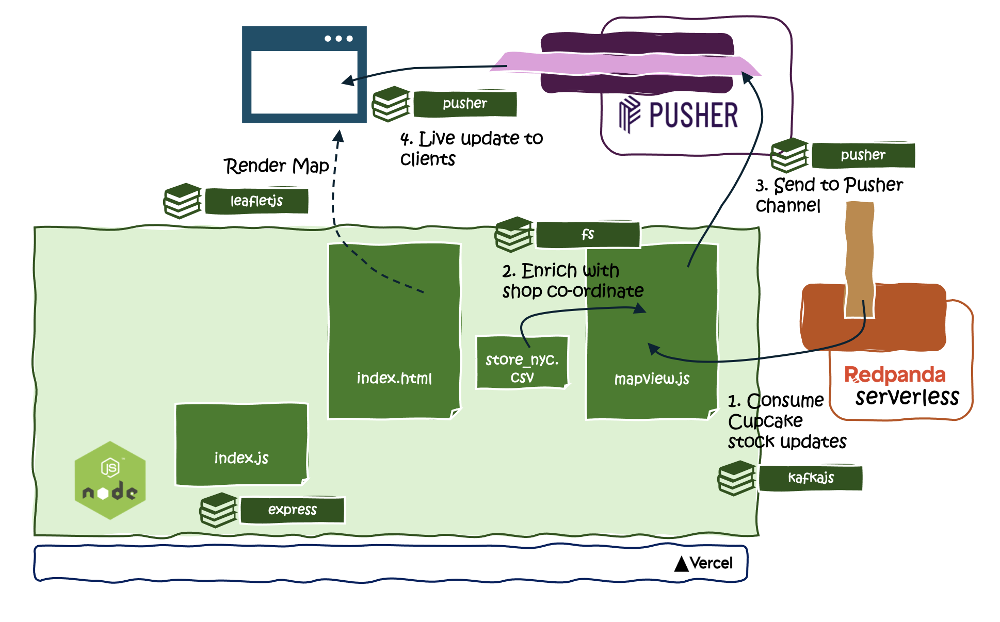
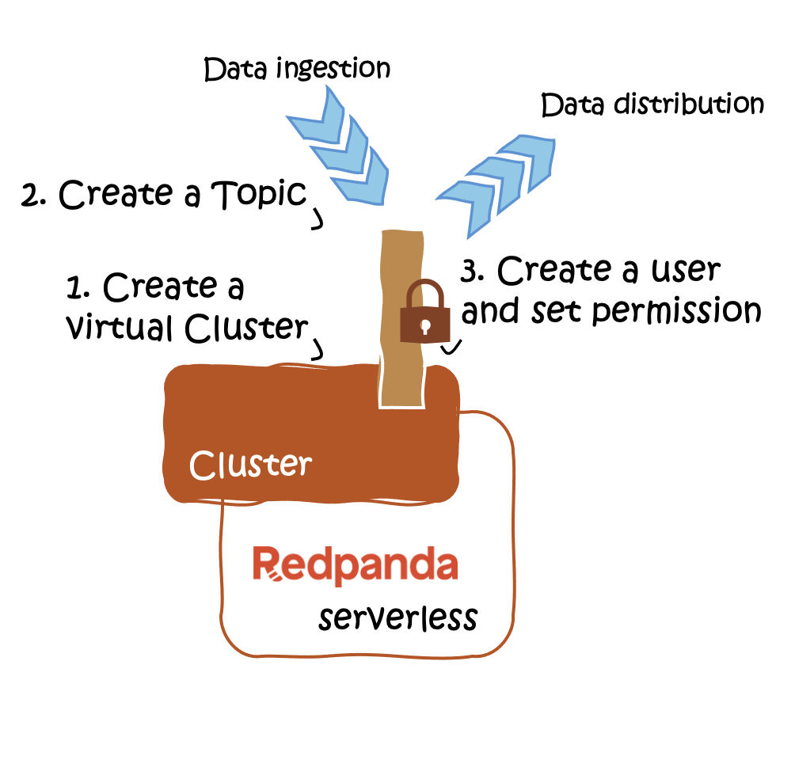
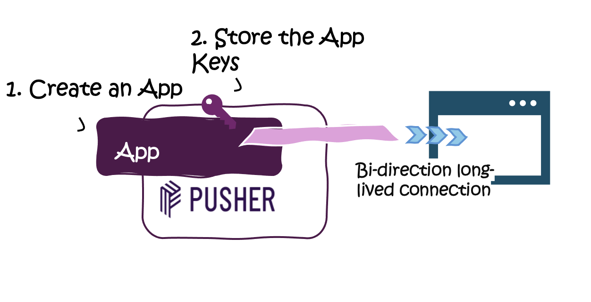
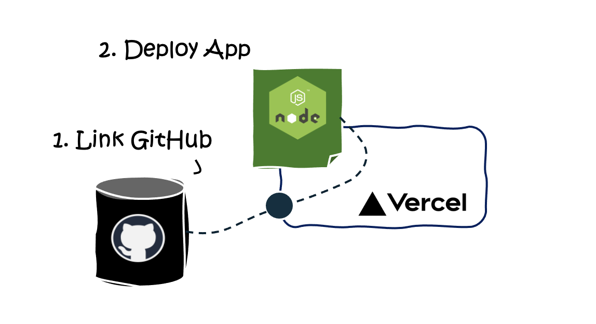

# Overview

This real-time, interactive application is designed to keep fans informed about the current stock of cupcakes for a new cupcake business in New York City. Leveraging the power of Redpanda Serverless for data streaming and Vercel for deployment, the app offers instantaneous updates on cupcake availability, enhancing customer engagement and inventory management.

## Features

- __Real-time Cupcake Stock Updates__: Utilizes Redpanda Serverless to stream data about cupcake availability.
- __Interactive Map__: Leverages LeafletJS for displaying dynamic updates of cupcake stocks across different locations.
- __WebSocket Updates__: Incorporates Pusher Channel/Websocket for real-time, serverless data push to the app.
- __Simplified Deployment__: Hosted on Vercel or you can run locally for easy deployment.


## Technology Stack

- **Redpanda Serverless**: For creating and managing data streams with ease and efficiency.
- **NodeJs**: The backend framework used for server-side logic.
- **LeafletJS**: A JavaScript library for mobile-friendly interactive maps.
- **Vercel**: For hosting the NodeJS application and providing seamless deployment and GitHub integration.
- **Pusher Channel**: For WebSocket service that enables real-time data push to the application.

## Applicaticon Structure and Files



- `index.js`: Serves as the main server file, setting up the Express server, defining routes 
    - submitting inventory updates _/submit_ and interacts with Kafka to produce messages whenever inventory data is submitted
    - clearing inventory _/clean-inventory_ 
    - serving the main app _/_ 
    - input form _/input_
- `mapview.js`: Handles the consuming from Redpanda, updating the inventory list(memorymap ), and then using Pusher to push these updates to the front end (optionally go to `cupcake` folder to push to websocket service ). It also locads the store IDs to their locations, ensuring that inventory updates can be accurately represented on a map.
- `store_nyc.csv`: List of cupcake partner stores with geographical locations and names in NYC
- `index.html`: Front end of the application, displaying the real-time map and inventory updates to users.
- `input.html & input.js`: Form for submitting cupcake inventory updates.
- `submit.js`: Handle the submission of inventory updates from the client side, posting data to the server.
 

## Getting Started

### Setup Redpanda Serverless

1. Sign up and navigate to the Redpanda Web UI.
2. Click on the "Create Cluster" button and select a region close to your workload.
3. Create a user by going to *Security* on the left menu, and set permissions (at least enable read and write to topic name `inv-count`)
4. Create a topic called  `inv-count` for cupcake stock updates


### Initial Setup
You can choose either the `cupcake` or `cupcake-pusher` directory based on your real-time update preference and navigate into the chosen folder.
- `cupcake`: allows you to run the application locally in your machine without the need from Pusher.
- `cupcake-pusher`: lets you deploy the application on Vercel and use *Pusher* to push update to the web page 


### Option one: Running locally
1. Clone the repository and navigate to the project directory. `git clone https://github.com/weimeilin79/cupcakefanatic.git`
2. Go to folder `cupcake`
3. Set your local environment variable from Redpanda Serverless
```
export SERVERLESSBROKER=<YOUR_SERVERLESS_BOOSTRAP_URL>
export RPUSER=<USER_YOU_CREATED_IN_RP_SERVERLESS>
export RPPWD=<USER_YOU_CREATED_IN_RP_PWD>
```
4. Install the NodeJS application dependencies by running  `npm install`
5. Start the application `node index.js`
6. Your application will be ready on in `http://localhost:3000`


### Option two: Deploying to Vercel
1. Fork the repository and clone locally `git clone https://github.com/weimeilin79/cupcakefanatic.git`
2. Set up a serverless function with [Pusher](https://pusher.com/channels/) Channel for WebSocket communication.
3. Create an app in Pusher,copy the application key 
```
app_id = "<YOUR_PUSHER_APP_ID>"
export key = "<YOUR_PUSHER_KEY>"
export secret = "<YOUR_PUSHER_SECRET>"
export cluster = "<YOUR_PUSHER_CLUSTER>"
```


1. In `index.html` replace the PUSHER_APP_ID and PUSHER_CLUSTER with your <YOUR_PUSHER_APP_ID> and <YOUR_PUSHER_CLUSTER>
2. Import the project, select `cupcakefanatic` as your repo and choose `cupcake-pusher` as the root directory.
3. Push the code to your Github repository.
4. Linking your GitHub repository with Vercel.
5. In vercel, in `Import Project` and add the repo from your git repository, click `Import`
8. Select as `cupcake-pusher` Root Directory  
9. In *Environment Variables* enter the following setting with your own configuration
```
PUSHER_APP_ID=<YOUR_PUSHER_APP_ID>
PUHSER_APP_KEY=<YOUR_PUSHER_KEY>
PUHSER_APP_SECRET=<YOUR_PUSHER_SECRET>
UHSER_APP_CLUSTER=<YOUR_PUSHER_CLUSTER>
SERVERLESSBROKER=<YOUR_SERVERLESS_BOOSTRAP_URL>
RPUSER=<USER_YOU_CREATED_IN_RP_SERVERLESS>
RPPWD=<USER_YOU_CREATED_IN_RP_PWD>

```

10.  Click deploy to start.


## Setting Up and Start the Simulator
1. Navigate to the `simulator` folder.
2. Ensure Python is installed on your system.
3. Install the Python dependencies listed in the requirements.txt file by running `pip install -r requirements.txt`.
4. Start the simulator by running `python simulator.js`

## Video 
[](https://www.youtube.com/watch?v=MKLOcFopKXM)